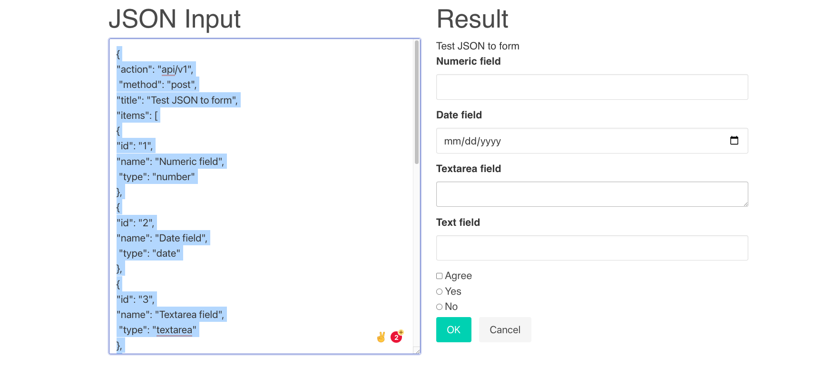

# Getting Started with Json-To-Form
It producing HTML form from the JSON configuration.
This project was bootstrapped with [Create React App](https://github.com/facebook/create-react-app).

## Live Demo
[Json-to-form](https://json-to-form-45b59.web.app/)

## Json config example
```json
{
"action": "api/v1",
 "method": "post",
"title": "Test JSON to form",
"items": [
{
"id": "1",
"name": "Numeric field",
 "type": "number"
},
{
"id": "2",
"name": "Date field",
 "type": "date"
},
{
"id": "3",
"name": "Textarea field",
 "type": "textarea"
},
{
"id": "4",
"name": "Text field",
 "type": "text"
},
{
 "type": "checkbox",
"value": "Agree"
},
{
 "type": "radio",
"name": "rad",
"value": "Yes"
},
{
 "type": "radio",
"name": "rad",
"value": "No"
},
{
 "type": "button",
"value": "OK"
},
{
 "type": "button",
"value": "Cancel"
}
]
}
```
It produce such output:


